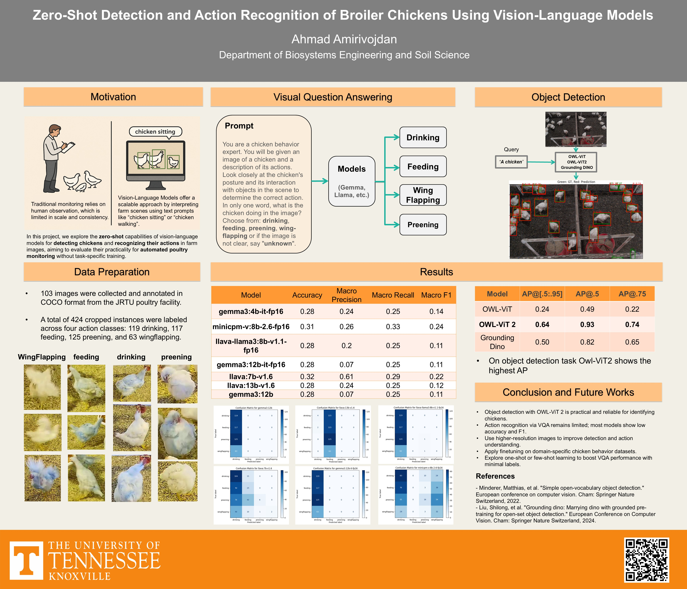

# Zero-Shot Detection and Action Recognition of Broiler Chickens Using Vision-Language Models

This repository presents the **final project for DSE 697 - Large Language Modeling & Gen AI**. The project explores the **zero-shot capabilities of state-of-the-art Vision-Language Models (VLMs)** to detect and recognize the actions of broiler chickens using only natural language queries-without any task-specific training.

---

## Project Goals

- Automatically detect and recognize chicken actions (e.g., feeding, drinking, wing flapping, preening) from farm images
- Evaluate the performance of popular vision-language models for both object detection and visual question answering (VQA)
- Investigate the potential of zero-shot learning in precision livestock farming

---

## Project Poster



A visual summary of our dataset, motivation, VQA setup, detection models, and results can be found in the presentation slide `ChickenVLM.pdf`.

---

## Datasets

### 1. ChickenCOCO
- Format: COCO-style annotations
- Purpose: Used for object detection task
- Content: 103 annotated images with 424 cropped instances across 4 actions:
  - Drinking (119), Feeding (117), Preening (125), Wingflapping (63)

### 2. ChickenVerse4
- Format: Image-level labels
- Purpose: Used for visual classification and VQA
- Actions: Same 4 categories

### Unzipping the Datasets

```bash
unzip ChickenCOCO.zip -d ./dataset
unzip ChickenVerse4.zip -d ./ChickenVerse4
```

---

## Models Evaluated

###  Zero-Shot Object Detection
- **Grounding DINO** (`IDEA-Research/grounding-dino-tiny`)
- **OWL-ViT** (`google/owlvit-base-patch32`)
- **OWL-ViT v2** (`google/owlv2-base-patch16-ensemble`)

### Visual Question Answering (VQA)
- **Gemma (3B & 7B)**
- **MiniCPM**
- **LLaVA (13B & 7B)**

---

## Key Results

### 🔎 Object Detection (AP Scores)

| Model         | AP@[.5:.95] | AP@.5 | AP@.75 |
|---------------|-------------|-------|--------|
| OWL-ViT       | 0.24        | 0.49  | 0.22   |
| **OWL-ViT 2** | **0.64**    | **0.93** | **0.74** |
| Grounding DINO| 0.50        | 0.82  | 0.65   |

 **OWL-ViT 2 achieved the best performance across all metrics**.

### VQA (Behavior Classification)

| Model                  | Accuracy | Macro Precision | Macro Recall | Macro F1 |
|------------------------|----------|------------------|---------------|-----------|
| gemma3:4b-it-fp16      | 0.28     | 0.24             | 0.25          | 0.14      |
| minicmp-v:8b-2.6-fp16  | 0.31     | 0.26             | 0.33          | 0.24      |
| llava-llama3-8b-v1.1   | 0.28     | 0.22             | 0.25          | 0.11      |
| gemma3:12b-it-fp16     | 0.28     | 0.07             | 0.25          | 0.11      |
| llava:7b-v1.6          | 0.32     | 0.61             | 0.29          | 0.22      |
| llava:13b-v1.6         | 0.28     | 0.24             | 0.25          | 0.14      |
| gemma3:12b             | 0.28     | 0.07             | 0.25          | 0.11      |

**VQA remains limited**, with relatively low macro scores.

---

## Installation

Install all required packages with:

```bash
pip install -r requirements.txt
```

---

## Running the Project

After installing the dependencies and extracting the datasets:

```bash
python zero_shot_object_detection.py
```

This script will:
- Load and evaluate all three detection models
- Save predictions in COCO format
- Run evaluation and print out detection metrics

---

## Future Work

- Improve performance by using higher-resolution inputs
- Explore fine-tuning on chicken-specific datasets
- Use one-shot learning or hybrid models for VQA
- Expand dataset with more behavior diversity and examples


---

##  Running VQA Classification (Ollama)

To try the Visual Question Answering (VQA) classification task, follow these steps:

### 1. Install Ollama

Visit [https://ollama.com](https://ollama.com) and install Ollama for your platform (macOS, Windows, Linux).

### 2. Pull Required Models

Make sure you have pulled the following models using:

```bash
ollama pull gemma:7b
ollama pull gemma:4b
ollama pull llava:13b
ollama pull llava:7b
ollama pull minicmp
```

### 3. Run the Notebook

Activate the same environment used earlier and launch the Jupyter notebook:

```bash
jupyter notebook VQA_classification.ipynb
```

This notebook uses the ChickenVerse4 dataset and prompts each model with a zero-shot VQA question like:

> *"What is the chicken doing in the image? (drinking, feeding, preening, wingflapping)"*

The responses are evaluated against the ground truth labels.


---

For questions or collaboration inquiries, feel free to reach out. 
